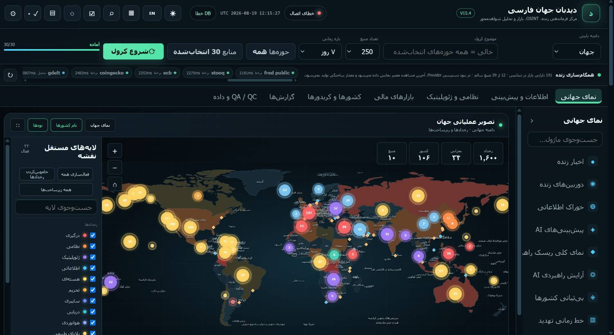
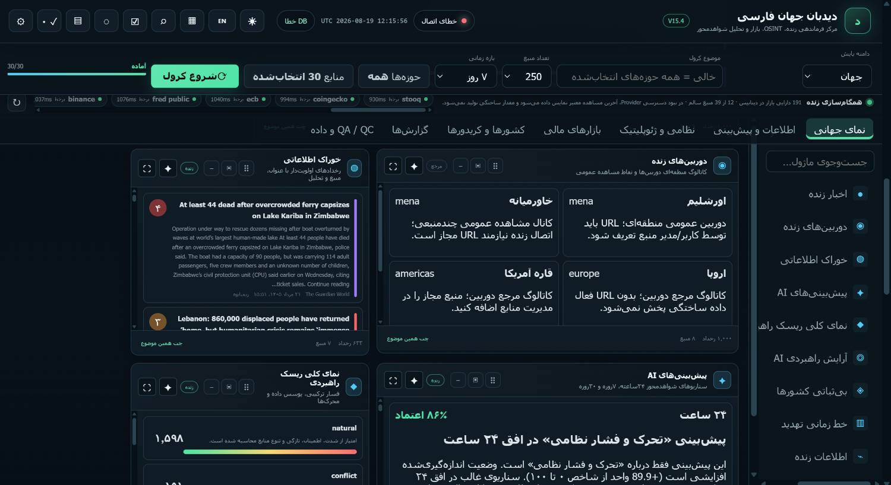
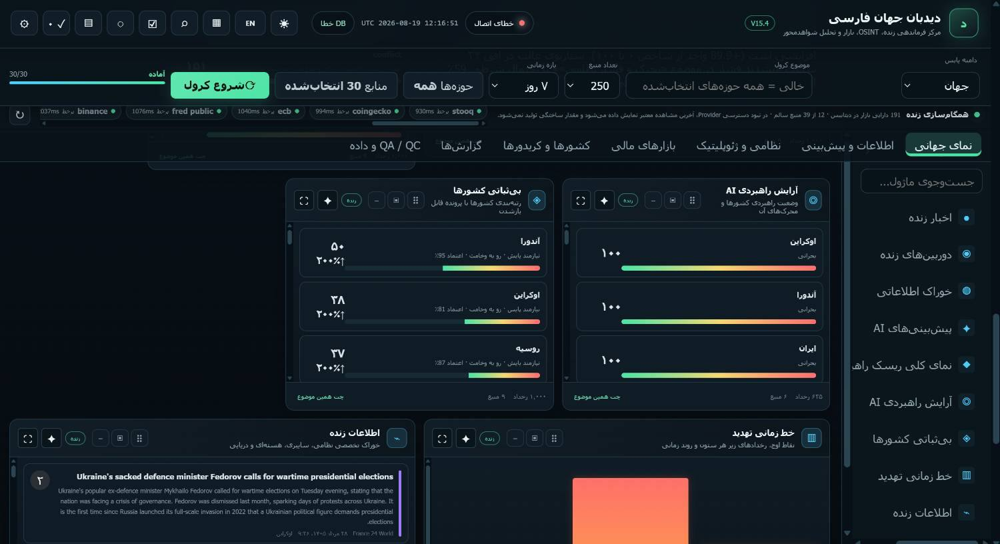
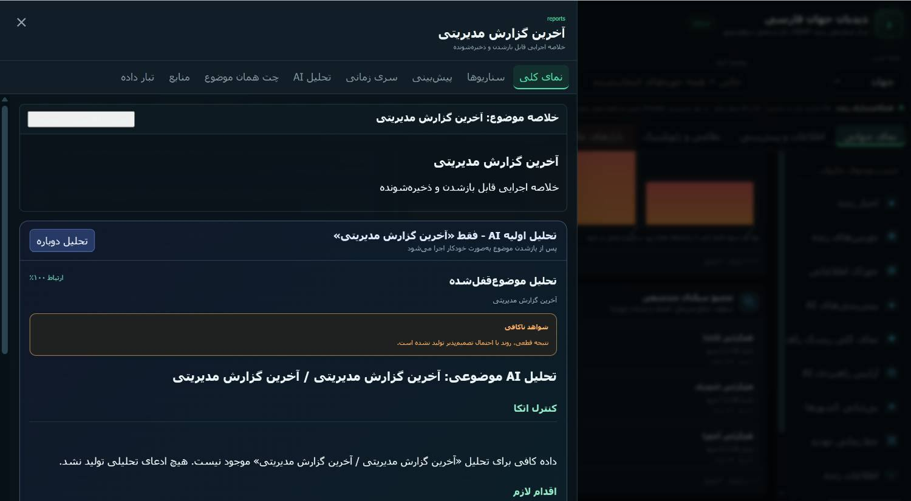
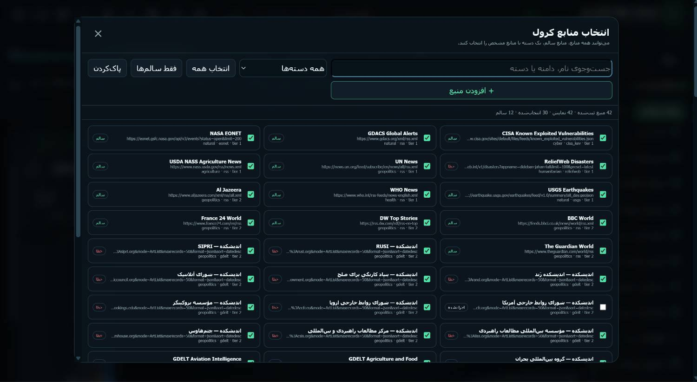
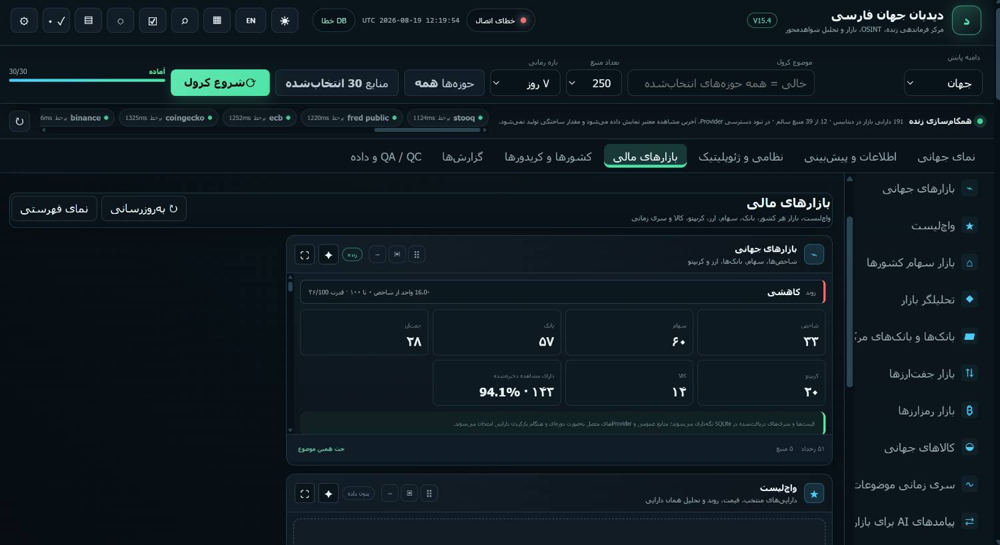
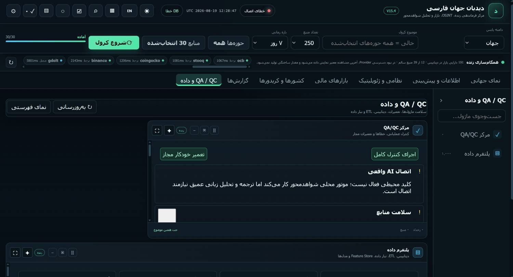

# Didehban Jahan — Product Foundation and AI Context

> Canonical project context for product strategy, information architecture, UX/UI design, data architecture, AI behavior, and future implementation.

| Field | Value |
|---|---|
| Product name | Didehban Jahan (دیده‌بان جهان, “World Observer”) |
| Document status | Approved product understanding; implementation has not started |
| Document language | English |
| Product languages | Persian-first (RTL), with a complete English mode |
| Primary use | Shared context for humans and AI-assisted design/development tools |
| Last updated | 2026-08-24 |
| Current reference build | V15 screenshots supplied by the product owner |
| Target | A ground-up redesign and standalone, multi-tenant product |

---

## Table of Contents

1. [How to Use This Document](#1-how-to-use-this-document)
2. [Executive Summary](#2-executive-summary)
3. [Confirmed Product Decisions](#3-confirmed-product-decisions)
4. [Product Boundaries](#4-product-boundaries)
5. [Users, Organizations, and Roles](#5-users-organizations-and-roles)
6. [Multi-Tenant Product Model](#6-multi-tenant-product-model)
7. [Conceptual Data Model](#7-conceptual-data-model)
8. [Source Management and Data Pipeline](#8-source-management-and-data-pipeline)
9. [AI Analysis and Report Contract](#9-ai-analysis-and-report-contract)
10. [Information Architecture](#10-information-architecture)
11. [Page Blueprints](#11-page-blueprints)
12. [Primary User Journeys](#12-primary-user-journeys)
13. [Module Design Contract](#13-module-design-contract)
14. [Visual and Interaction Direction](#14-visual-and-interaction-direction)
15. [V15 Reference Analysis](#15-v15-reference-analysis)
16. [Benchmark Analysis](#16-benchmark-analysis)
17. [Functional Requirements Inventory](#17-functional-requirements-inventory)
18. [Non-Functional Requirements](#18-non-functional-requirements)
19. [MVP and Delivery Priorities](#19-mvp-and-delivery-priorities)
20. [Initial Acceptance Criteria](#20-initial-acceptance-criteria)
21. [Research Limitations](#21-research-limitations)
22. [Open Decisions and Validation Backlog](#22-open-decisions-and-validation-backlog)
23. [Research and Source Register](#23-research-and-source-register)
24. [Glossary](#24-glossary)
25. [Handoff Guidance](#25-handoff-guidance-for-future-design-and-development)

---

## 1. How to Use This Document

This file is the current single source of truth for understanding Didehban Jahan before design and implementation begin.

All contributors and AI agents should follow these rules:

1. Treat items marked **Confirmed** as authoritative product decisions.
2. Treat items marked **Proposed** as the current recommended design direction, subject to refinement during product design.
3. Treat items marked **Open** as unresolved. Do not silently invent an answer.
4. Do not reproduce the V15 interface as the target design. V15 is a capability inventory and discovery prototype.
5. Preserve the separation between report consumption, organization administration, and data operations.
6. Preserve traceability from every important AI-generated claim to evidence, source, timestamp, and uncertainty.
7. Design Persian and RTL behavior as a first-class system, not as a later translation layer.
8. Assume the target product may serve multiple organizations with different users, permissions, data sources, modules, and branding.
9. Prefer clear defaults and progressive disclosure over exposing every control at once.
10. Before changing a confirmed decision, record the new decision and its rationale in this file.

### Decision labels

- **Confirmed:** Explicitly stated or approved by the product owner.
- **Proposed:** Recommended by the product design analysis and accepted as the working direction, but still refinable.
- **Open:** Requires product, technical, legal, data, or user validation.
- **Observed:** Seen in the supplied V15 screenshots or benchmark interfaces; not automatically a requirement.

---

## 2. Executive Summary

### 2.1 Product definition

**Confirmed:** Didehban Jahan is a Persian-first intelligence and reporting platform that collects live data from many sources and locations, analyzes the collected information with AI, and presents understandable reports through text, charts, timelines, maps, heat maps, and other visual formats.

The target product is not merely a dashboard containing many widgets. It should become an **evidence-based intelligence workspace** that transforms fragmented data into a traceable chain:

```text
Source → Raw Item → Normalized Event → Evidence Cluster → Signal → Assessment → Report
```

### 2.2 Product promise

> Didehban Jahan transforms fragmented, multi-source live data into a clear, current, and traceable view of the world.

### 2.3 Product mission

Collect heterogeneous public, specialist, licensed, and organization-specific data; normalize and correlate it; use AI to create evidence-based assessments and reports; and deliver the result to users according to their organization, role, permissions, geography, domain, and information needs.

### 2.4 Product identity

The intended identity is:

- An intelligence workspace, not a wall of widgets.
- A reporting product for general users, not only trained analysts.
- Persian-first and RTL-native.
- Live and multi-source.
- AI-generated, but transparent about evidence and uncertainty.
- Multi-tenant and customizable for different organizations.
- Dense enough for serious monitoring, but calm and understandable by default.

---

## 3. Confirmed Product Decisions

### 3.1 Current audience and usage

- **Confirmed:** The current version runs inside IAPS, a panel available within Algonet.
- **Confirmed:** Anyone with an IAPS account can access the current Didehban experience.
- **Confirmed:** Current users are general users rather than a narrowly defined professional analyst persona.
- **Confirmed:** The primary current behavior is viewing and consuming reports.
- **Open:** Users may later make decisions or perform deeper analysis based on the reports, but the exact decision-making jobs are not yet defined.

### 3.2 Target distribution model

- **Confirmed:** The redesigned product will eventually exist outside IAPS as a standalone product.
- **Confirmed:** The product may be customized and delivered to other organizations.
- **Confirmed:** Each customer organization may have a manager who creates and manages that organization’s users.
- **Confirmed:** Users will have different access levels according to their needs.
- **Confirmed:** The target architecture must support organization-level customization and role-based access.
- **Proposed:** The product should be designed as multi-tenant from the foundation, even if the first deployment serves only one organization.

### 3.3 Sources and data

- **Confirmed:** The team intends to obtain APIs for all planned domains.
- **Confirmed:** Data should be displayed live or as close to real time as the upstream source allows.
- **Confirmed:** Users need source selection, source search, source counts, healthy/error states, time filters, domain filters, geographic scope filters, global report search, theme switching, and Persian/English switching.
- **Confirmed:** In the current version, all users can manage sources.
- **Confirmed:** In the redesigned version, source and crawl operations will be permission-controlled.
- **Open:** Exact API providers, licenses, rate limits, costs, historical depth, service-level guarantees, and geographic coverage remain to be validated.

### 3.4 AI behavior

- **Confirmed:** AI analyzes the available data according to the sources assigned to it.
- **Confirmed:** AI creates the reports shown to users.
- **Confirmed:** A human user does not need to approve each report before it is displayed.
- **Proposed:** Automatic publication requires strong provenance, confidence, freshness, contradiction, versioning, and audit mechanisms because approval is not manual.
- **Open:** Exact model providers, evaluation methods, hallucination controls, prompt architecture, cost controls, and model fallback policy remain technical decisions.

### 3.5 Interface and modules

- **Confirmed:** Most pages contain report modules that can include text, metrics, bar charts, line charts, scatter plots, maps, heat maps, and other data visualizations.
- **Confirmed:** Modules should support repositioning, AI analysis, and size changes where appropriate.
- **Proposed:** Dragging and resizing should only be active in an explicit **Edit Layout** mode; normal mode should prioritize reading and interaction.
- **Confirmed:** The product must support dark and light modes.
- **Confirmed:** The product must support Persian and English.

### 3.6 Resolved onboarding questions

| Question raised during onboarding | Confirmed answer from the product owner | Product implication |
|---|---|---|
| Who is the primary first user, and what decision do they make? | Today, any user with an IAPS account can access the product. They are general users and primarily consume reports. Later decision-making behavior is not yet defined. | The default experience must be understandable by non-specialists. Decision-support workflows remain an open research area. |
| Who can add sources and start crawls? | Everyone can do this in the current version. The redesigned version will have access levels. | Source and crawl operations must move behind role-based permissions and a separate data-management experience. |
| Which three domains are the MVP priority and already have real data? | The team plans to obtain APIs for all domains and show the data live. | The platform model must support all domains, while delivery should still validate an end-to-end vertical slice before expanding breadth. |
| What is the permitted role of AI, and is human approval required? | AI analyzes assigned sources and creates the reports shown to users. User approval is not required before display. | Automatic publication requires provenance, confidence, limitations, freshness, report versioning, and auditability. |
| Is the product internal or public, and does it need organizational roles? | It currently runs internally in IAPS. The redesigned product will also be delivered outside IAPS to different organizations. An organization manager may define users and access levels. | The foundation must support standalone deployment, multi-tenancy, organization administration, customization, and tenant isolation. |

---

## 4. Product Boundaries

### 4.1 What the product is

- A multi-source monitoring and reporting platform.
- A live operational view of global, regional, country, market, corridor, security, and other domain data.
- A system that turns raw data into normalized events, signals, assessments, and reports.
- An AI-generated reporting environment with source traceability.
- A configurable product for multiple organizations and user roles.
- A workspace that supports overview, exploration, comparison, monitoring, and export.

### 4.2 What the product is not

- Not a generic news reader.
- Not only a map.
- Not only an executive dashboard.
- Not only a data operations console.
- Not a collection of unrelated mini-applications.
- Not a fully autonomous authority that should hide uncertainty.
- Not a design that exposes crawl, database, provider, and QA controls to every viewer.
- Not a direct visual clone of any benchmark.

### 4.3 Out of scope for the current foundation phase

- Final API contracts and vendor selection.
- Production infrastructure and security implementation.
- Final pricing and packaging.
- Legal approval of each data source.
- Prediction-model validation against historical truth.
- Final organization onboarding flow.
- Final mobile feature scope.
- Detailed UI screens or implementation code.

---

## 5. Users, Organizations, and Roles

### 5.1 Primary user model

The default user is a **report consumer**. The user may not be a trained intelligence analyst and should be able to understand important developments without learning data operations or technical monitoring concepts.

Core user jobs:

1. Understand the most important changes within minutes.
2. Review a country, region, market, domain, or corridor in more depth.
3. Move from an AI claim to the supporting evidence and original source.
4. Compare changes across time and geography.
5. Request or open an AI analysis with a clear scope and confidence level.
6. Search, filter, save, reopen, export, or share a view or report when permitted.
7. Receive a consistent view of live, stale, incomplete, or unavailable data.
8. In an authorized administrative role, configure users, sources, or data operations.

### 5.2 Proposed base roles

The following are recommended platform defaults. Organizations may customize them.

| Role | Primary purpose | Typical capabilities |
|---|---|---|
| Platform Owner | Operate the overall product | Create organizations, manage global configuration, inspect platform-wide health, manage platform policies |
| Organization Admin | Operate one customer organization | Create users, assign roles, select enabled modules, configure organization settings and branding |
| Data Manager | Operate organization data | Add sources, configure APIs, run/retry ingestion jobs, inspect source health, manage QA/QC |
| Power User | Perform deeper investigation | Save workspaces, compare entities, use advanced filters, generate/export reports, use AI analysis |
| Viewer | Consume approved product capabilities | View reports, maps, charts, evidence, search results, and permitted exports |

### 5.3 Permission principles

- Default to least privilege.
- Permissions must be organization-scoped.
- A user must never see another organization’s private sources, reports, settings, or activity.
- Administrative navigation must be hidden when the user lacks access, not merely disabled.
- View, export, share, source management, AI generation, layout editing, and organization administration should be separate permission groups.
- Source visibility may be platform-wide, organization-wide, team-specific, or private if required later.
- Important configuration changes and AI report versions should be auditable.

### 5.4 Open user questions

- What decisions do general users actually make after reading a report?
- Which user segments need alerts versus passive reporting?
- Which roles may create versus only view AI reports?
- Can organizations define custom roles from individual permissions?
- Which actions require stronger authentication or approval?

---

## 6. Multi-Tenant Product Model

### 6.1 Tenant hierarchy

```text
Platform
└── Organization
    ├── Branding and configuration
    ├── Enabled domains and modules
    ├── Data sources and API credentials
    ├── Users, teams, roles, and permissions
    ├── Saved views and reports
    ├── Alerts and watchlists
    └── Audit and usage history
```

### 6.2 Stable product core

The following should remain consistent across customers:

- Data entities and event contract.
- Evidence and source attribution model.
- AI report contract.
- Core navigation principles.
- Data-state semantics.
- Accessibility behavior.
- RTL and bilingual rules.
- Security boundaries.
- Audit model.
- Core design system.

### 6.3 Organization-configurable elements

- Organization name, logo, color accent, and approved branding.
- Enabled modules and domains.
- Geographic scope.
- Sources and API integrations.
- Default dashboard and saved views.
- Roles and permissions.
- Alert policies and watchlists.
- Report templates and export policies.
- Supported languages.
- Data-retention and sharing policies.

### 6.4 Guardrail against excessive customization

Customization should occur through configuration and design tokens, not through a different product architecture for every customer. The platform should maintain one coherent product model and avoid becoming a collection of unrelated client-specific forks.

---

## 7. Conceptual Data Model

### 7.1 Core entities

#### Source

A public, specialist, licensed, internal, or user-added origin of data.

Suggested fields:

- `source_id`
- `organization_id` or platform scope
- name and URL
- source type: API, RSS, website, dataset, stream, or manual
- language
- domain and subdomain
- geographic coverage
- owner and known affiliation
- initial trust tier
- propaganda or bias risk, where applicable
- license and usage policy
- expected cadence
- parser or connector
- active/inactive status
- last successful fetch
- current latency
- error rate
- freshness state

#### Raw Item

The unmodified record received from a source.

Suggested fields:

- raw identifier
- source identifier
- retrieval timestamp
- original publication timestamp
- original payload or reference
- content checksum
- parsing status

#### Event

A normalized occurrence with time, geography, actors, topic, and extracted attributes.

Suggested fields:

- event identifier
- title and summary
- start/end time
- detected geography
- actors and organizations
- domain and event type
- severity and importance
- coordinates, where relevant
- source items
- freshness
- lifecycle status

#### Evidence Cluster

A set of independent or related items describing the same event after deduplication and correlation.

Suggested fields:

- cluster identifier
- linked event
- supporting sources
- contradicting sources
- independence estimate
- corroboration level
- known information gaps

#### Signal

A meaningful change, anomaly, threshold crossing, or cross-source convergence.

Suggested fields:

- signal identifier
- linked events and indicators
- detection method
- time horizon
- significance
- affected entities
- confidence

#### Assessment

An AI or human interpretation of meaning, severity, confidence, and likely development.

Suggested fields:

- assessment identifier and version
- scope
- generated timestamp
- model and method reference
- claims
- supporting and contradicting evidence
- confidence and rationale
- limitations
- scenarios or outlook

#### Report

A saved and exportable product output composed of assessments, evidence, charts, maps, and narrative.

Suggested fields:

- report identifier and version
- organization and authoring context
- generated-by AI/user/system
- title, scope, and time range
- included modules and claims
- citations and evidence snapshot
- creation and update timestamps
- sharing/export permissions
- archived or active state

### 7.2 Supporting entities

- Organization
- User
- Role
- Permission
- Team
- Domain
- Geography
- Country
- Region
- Corridor
- Chokepoint
- Market instrument
- Indicator
- Source set
- Saved view
- Dashboard layout
- Watchlist
- Alert rule
- Ingestion job
- Data-quality issue
- AI run
- Audit event

### 7.3 Data lifecycle

```text
Discover or add source
→ Validate connection and license
→ Ingest raw data
→ Parse and normalize
→ Deduplicate and cluster
→ Enrich with geography, actors, topics, and time
→ Detect events and signals
→ Produce AI assessment
→ Render module and report
→ Preserve provenance, version, and audit history
```

---

## 8. Source Management and Data Pipeline

### 8.1 Source-management requirements

Authorized users need to:

- Add a source or API.
- Detect or select the source type.
- Search sources.
- Filter by domain, category, language, geography, health, and status.
- Select active sources.
- View selected and total source counts.
- Distinguish healthy, degraded, failed, disabled, and pending sources.
- Review connection latency, last success, and recent error.
- Activate, deactivate, test, or retry a source.
- Understand licensing or usage limitations.

### 8.2 Proposed source onboarding flow

```text
Add URL or API
→ Detect type
→ Test connection
→ Preview sample data
→ Suggest category, language, and geography
→ Define trust, affiliation, and license
→ Save inactive or activate
→ Monitor health
```

### 8.3 Crawl and ingestion jobs

The “Start Crawl” action should not live in the normal report-consumption header. In the data-management experience, ingestion should be represented as jobs with clear states:

- `queued`
- `running`
- `completed`
- `partial`
- `failed`
- `cancelled`

Each job should show:

- progress
- start and end time
- processed record count
- successful and failed records
- affected sources
- actionable error summary
- retry behavior
- generated data-quality warnings

### 8.4 Data freshness

“Live” must be defined according to the source. The interface should distinguish:

- Fresh/live
- Recently cached
- Stale
- Delayed upstream
- Partial coverage
- No recent data
- Source unavailable

Exact thresholds may vary by source or domain and should be configuration-driven.

---

## 9. AI Analysis and Report Contract

### 9.1 AI responsibility

AI is an automated analyst and report generator. It may summarize, correlate, explain, compare, and forecast according to available data and configured product policies. Its reports do not require manual user approval before display.

### 9.2 Mandatory structure for AI output

Every AI assessment should contain:

1. **One-sentence summary**
2. **What changed?**
3. **Why does it matter?**
4. **Supporting evidence** with source and timestamp
5. **Contradicting evidence or information gaps**
6. **Confidence level and rationale**
7. **Time horizon and scenarios**, if predictive
8. **Suggested monitoring item or action**, explicitly labeled as a suggestion rather than fact
9. **Data freshness and coverage note**
10. **Generation timestamp and assessment version**

### 9.3 Trust dimensions

Never collapse all trust signals into one percentage. Keep these concepts separate:

| Dimension | Question answered |
|---|---|
| Event importance | How significant is the event? |
| Source credibility | How reliable is the origin? |
| Analysis confidence | How strongly does the evidence support this AI assessment? |
| Data quality | How complete, fresh, consistent, and usable is the underlying data? |
| Forecast probability | How likely is a future scenario according to the relevant model or market? |

A highly important event may still have weak source credibility. A high model probability may still be based on incomplete data. The interface must make these differences understandable.

### 9.4 Required AI guardrails

- No definitive claim when evidence is insufficient.
- No hidden removal of contradictory evidence.
- Direct links to supporting sources where permissions allow.
- Explicit timestamps and geographic scope.
- Clear distinction between observation, inference, forecast, and recommendation.
- Preserve the evidence snapshot used for a generated report.
- Record model, prompt or policy version, and generation time for auditability.
- If a source becomes unavailable later, preserve the citation metadata used at generation time.
- Clearly label generated content as AI-generated.
- Gracefully explain when analysis cannot be produced.

### 9.5 AI module action

Each relevant module may expose **Analyze with AI**. The action should explain:

- what module or data scope will be analyzed
- active geography, time range, domains, and source set
- whether the result is a summary, assessment, comparison, or forecast
- expected generation state
- reason for failure when evidence is insufficient

---

## 10. Information Architecture

### 10.1 Current V15 page names

The current product contains seven top-level areas:

1. Global View
2. Information and Forecasting
3. Military and Geopolitics
4. Financial Markets
5. Countries and Corridors
6. Reports
7. QA and Data

The current Persian labels are provisional and should be improved for clarity.

### 10.2 Proposed top-level navigation

| Proposed English label | Proposed Persian label | Purpose |
|---|---|---|
| World Monitor | رصد جهان | Map, major developments, alerts, key indicators, and daily brief |
| Developments & Forecasts | تحولات و پیش‌بینی | Signals, trends, scenarios, forecasts, horizons, and confidence |
| Security & Geopolitics | امنیت و ژئوپلیتیک | Conflict, military, sanctions, protest, cyber, and strategic infrastructure |
| Economy & Markets | اقتصاد و بازارها | Markets, commodities, currencies, crypto, macro indicators, and event impact |
| Countries & Routes | کشورها و مسیرها | Country/region profiles, comparison, corridors, chokepoints, and supply chains |
| Reports & Analysis | گزارش‌ها و تحلیل‌ها | Briefs, saved reports, report building, export, and sharing |
| Data Management | مدیریت داده | Sources, ingestion, health, quality, logs, and QA/QC; permission-restricted |

Final naming should be validated with Persian-speaking users before implementation.

### 10.3 Persistent application shell

#### Primary bar

- Product identity
- Global search and command access
- Watchlist
- Alerts
- Active organization
- Language
- Theme
- User profile

#### Context bar

- Geography
- Time range
- Domain
- Active source set
- Page-specific filters
- Collapsible to protect content space

#### Content canvas

- Map, timeline, modules, reports, or data operations according to the page mission

#### Inspector

- Opens event, country, indicator, source, or report details without immediately losing the current context

#### Data-status indicator

- A compact global summary of freshness, gaps, or outages
- Detailed technical state belongs in Data Management

### 10.4 Global search

Global search should support both finding and navigation:

- reports
- events
- countries and regions
- domains
- sources, when permitted
- modules
- commands and destinations

Searching for a country should open or suggest its country workspace, not only return text matches.

### 10.5 Core filters

- Source selection and source set
- Selected source count
- Time range: examples include 7 days, 1 month, 3 months, 1 year, and custom ranges
- Active domains
- Report scope: global, region, country, or multi-country selection
- Geography
- Language where relevant
- Data freshness or status where relevant
- Search across available reports

Filters should be context-aware. Technical filters must not dominate the viewer experience.

---

## 11. Page Blueprints

These blueprints describe page missions and likely content. They are not final wireframes.

### 11.1 World Monitor — رصد جهان

**Primary question:** What is happening now, and what deserves attention?

Recommended content:

- Global map as the primary surface
- Major development summary
- Daily brief
- Prioritized alerts
- Key global indicators
- Live event feed
- Layer controls with search and explanations
- Geographic drill-down
- Event Inspector
- Compact data-freshness status

Default behavior should be understandable within seconds. Advanced layers should use progressive disclosure.

### 11.2 Developments & Forecasts — تحولات و پیش‌بینی

**Primary question:** What is changing, what may happen next, and how certain is it?

Recommended content:

- Emerging signals
- Trend movement
- Threat timeline
- AI forecasts
- Scenario comparisons
- Confidence and horizon
- Supporting and contradicting evidence
- Saved monitoring questions

Every forecast must show horizon, method, confidence, freshness, and limitations.

### 11.3 Security & Geopolitics — امنیت و ژئوپلیتیک

**Primary question:** Where are geopolitical and security risks increasing or changing?

Recommended content:

- Active conflicts
- Military movement
- Bases and strategic infrastructure
- Sanctions
- Protests and civil instability
- Cyber incidents
- Country risk
- Cross-border relationships
- Geopolitical event timeline

### 11.4 Economy & Markets — اقتصاد و بازارها

**Primary question:** What is moving in the economy and markets, and what events explain it?

Recommended content:

- Global market overview
- Equities and indices
- Currencies
- Commodities
- Crypto assets
- Banks and major financial institutions
- Macro indicators
- Event-to-market impact
- Time series and comparison views
- AI market interpretation

### 11.5 Countries & Routes — کشورها و مسیرها

**Primary question:** What is the full multi-domain picture of a place or strategic route?

Each country should behave as a persistent workspace, not only a filter result.

Recommended country areas:

- Overview
- Brief
- News and events
- Security and geopolitics
- Economy and markets
- Cyber
- Air and transport
- Weather and hazards
- Health
- OSINT
- Related routes and corridors

Recommended route/corridor areas:

- Current route
- Alternatives
- Land options
- Chokepoints
- Affected countries
- Operational and economic impact
- Scenario impact

### 11.6 Reports & Analysis — گزارش‌ها و تحلیل‌ها

**Primary question:** What reports exist, how were they produced, and how can they be reused?

Recommended content:

- AI-generated reports
- Daily and periodic briefs
- Saved reports
- Report search and filters
- Report builder or collection workflow
- Evidence and source drawer
- Report history and versions
- Export and sharing according to permission
- Archived reports

### 11.7 Data Management — مدیریت داده

**Primary question:** Are sources and the pipeline healthy, current, licensed, and producing usable data?

Recommended content:

- Source directory
- API and connector configuration
- Ingestion jobs
- Source health
- Errors and retry
- Freshness and latency
- Coverage gaps
- Data-quality issues
- QA/QC
- Pipeline status
- Audit log

This page is role-restricted and should not be part of the normal viewer’s daily navigation.

---

## 12. Primary User Journeys

### 12.1 From global signal to report

```text
Open World Monitor
→ Notice a prioritized signal
→ Open event Inspector
→ Review summary, timeline, evidence, and contradictions
→ Open related country or domain workspace
→ Run scoped AI analysis
→ Add assessment to a report
→ Save, export, or share if permitted
```

### 12.2 Country investigation

```text
Search for a country
→ Open country workspace
→ Review brief and current status
→ Switch between relevant domains
→ Compare time or neighboring countries
→ Inspect evidence behind an important claim
→ Save the view or generate a report
```

### 12.3 Source onboarding

```text
Open Data Management
→ Add URL or API
→ Validate connection and preview data
→ Assign domain, geography, language, and trust metadata
→ Review license and cadence
→ Activate source
→ Monitor first ingestion job and health
```

### 12.4 Organization administration

```text
Create or open organization
→ Configure branding and enabled modules
→ Configure sources and policies
→ Create users or invite them
→ Assign roles and permissions
→ Set default workspace and report behavior
→ Review audit activity
```

---

## 13. Module Design Contract

Every module should have a consistent structure.

### 13.1 Header

- Clear title
- Active scope
- Geographic context
- Time range
- Status
- Last updated time
- Optional priority or alert indicator

### 13.2 Body

The module should answer one explicit question. It should not exist merely to display available data.

Examples:

- What changed?
- Which countries are deteriorating?
- Which route is disrupted?
- Which market moved and why?
- Which sources disagree?
- What is the current forecast?

### 13.3 Trust footer

- Independent source count
- Coverage period
- Freshness
- Data quality or known gap
- Confidence when analytical
- Methodology link

### 13.4 Actions

- Primary: open details or add to report
- AI: analyze this module
- Secondary: full screen, save, pin, export, share, hide
- Layout: move and resize only in Edit Layout mode

### 13.5 Standard module states

- Loading
- Fresh/live
- Cached
- Stale
- Partial coverage
- No data
- Error
- Access restricted

Each state needs a clear message, timestamp, and next action where possible.

---

## 14. Visual and Interaction Direction

### 14.1 Desired qualities

The visual system should feel:

- Trustworthy
- Calm under information pressure
- Precise
- Contemporary
- Operational without appearing militaristic by default
- Dense but readable
- Persian-native
- Suitable for both general viewers and advanced users

### 14.2 Hierarchy principles

1. Meaning before controls.
2. Important developments before system diagnostics.
3. One dominant task per page.
4. One primary action per module.
5. Technical detail on demand.
6. Status color should communicate state, not decorate the interface.
7. Critical alerts must be visually distinct from routine updates.
8. Evidence and freshness should remain near the claim they qualify.

### 14.3 Layout direction

- Use a stable application shell.
- Allow the main content surface to use the full available width.
- Avoid V15’s narrow central module columns surrounded by unused space.
- Support responsive grids, but do not let automatic layout destroy information hierarchy.
- Separate reading mode from layout-editing mode.
- Use drawers and Inspectors to preserve context during exploration.
- Use tabs only for stable peer views, not as a substitute for clear information architecture.

### 14.4 Color semantics

Exact tokens will be defined in the design system. Semantic roles should include:

- Neutral background and elevated surfaces
- Primary brand/action accent
- Informational
- Positive/healthy
- Warning/degraded
- Critical/error
- Inactive/disabled
- Forecast or AI-generated state
- Selected geography or layer

Do not use red, yellow, or green without a text/icon/state label. Design for color-vision accessibility.

### 14.5 Typography and bilingual behavior

- Persian typography is primary.
- English names, providers, tickers, URLs, and abbreviations require a defined mixed-script treatment.
- RTL layout must not reverse technical strings, timestamps, coordinates, ticker symbols, or URLs.
- Define consistent Persian/Latin numeral rules.
- Define Gregorian, Solar Hijri, UTC, and local-time presentation rules.
- Avoid unexplained English labels such as QA/QC, provider, cached, or pipeline in general-user areas.
- Use clear text labels for unfamiliar icon actions.

### 14.6 Maps

- The map should support exploration and monitoring, not act as a decorative background.
- Prioritize layers by page mission.
- Explain each layer’s meaning, freshness, and source.
- Avoid overlapping markers without clustering or aggregation.
- Support visible geographic scope and time range.
- Provide a non-map alternative for important data when accessibility or small screens require it.

### 14.7 Charts

- Choose charts according to the analytical question.
- Always show units, time range, source, and update time.
- Distinguish observed data from estimates or forecasts.
- Avoid unnecessary 3D effects and visual noise.
- Support comparison and tooltip details without hiding the main conclusion.
- Use annotations for major events that explain changes.

### 14.8 Dark and light modes

Both themes are confirmed requirements. Neither should be a mechanical color inversion. Maps, charts, status colors, shadows, borders, and text contrast require theme-specific validation.

### 14.9 Mobile and tablet

**Proposed:** Desktop is the primary full workspace. Mobile should prioritize report reading, alerts, search, watchlists, and focused event/country inspection. Advanced data management and dense multi-panel editing may remain desktop-first.

---

## 15. V15 Reference Analysis

The following screenshots document the existing V15 capability set. They are evidence for requirements and problems, not target wireframes.

### 15.1 Global map and layer controls



**Observed capabilities:**

- Global map as a primary view
- Independent event layers
- Map controls and clustering
- Global filters for scope, source count, domains, and time
- Crawl controls
- Provider health and response time
- Top-level page navigation and page-side module navigation

**Design finding:** The core map is valuable, but four stacked header/control layers create excessive cognitive load before the user reaches the content.

### 15.2 Global intelligence modules



**Observed capabilities:**

- Live camera directory
- Intelligence feed
- AI predictions
- Strategic risk overview
- Modular cards with status and controls

**Design finding:** Modular breadth is strong, but cards compete visually and lack a clear shared priority system.

### 15.3 Country instability and threat modules



**Observed capabilities:**

- AI strategic assessment by country
- Country instability scoring
- Live information
- Threat timeline
- Country-focused cards and confidence indicators

**Design finding:** The product contains useful analytical building blocks, but score meaning, evidence, confidence, and data quality are not consistently separated.

### 15.4 AI analysis drawer



**Observed capabilities:**

- AI analysis opened in a focused overlay/drawer
- Tabs for overview, scenarios, forecast, time series, AI analysis, related chat, sources, and raw data
- Re-analysis action
- Explicit insufficient-evidence warning

**Design finding:** The drawer is a useful interaction model. The report itself needs a mandatory claim/evidence/contradiction/confidence/freshness/version contract.

### 15.5 Source management



**Observed capabilities:**

- Source search
- Add source
- Category filtering
- Select all and healthy-only selection
- Healthy, failed, and unselected states
- Source URLs and metadata

**Design finding:** This is a valuable data-management capability, but it should be separated from the general viewer experience and governed by permissions.

### 15.6 Financial markets



**Observed capabilities:**

- Global markets
- Watchlist
- Country stock markets
- Market analysis
- Banks and central banks
- FX, crypto, and commodities
- Time-series and AI market impact modules

**Design finding:** The information architecture covers the domain well, but technical controls and empty canvas areas weaken default hierarchy.

### 15.7 QA/QC and data quality



**Observed capabilities:**

- QA/QC center
- Data pipeline
- AI connection warning
- Source-health warning
- Automated repair action
- Full validation action

**Design finding:** Explicit data quality is a major strength. It should remain available to authorized roles while being summarized, not fully exposed, to general viewers.

### 15.8 V15 strengths

- Ambitious and broad domain coverage.
- Map-first monitoring.
- Selectable data layers.
- Global filters.
- Provider health and latency visibility.
- Modular cards and focused analysis views.
- Source management.
- Explicit QA/QC and data-health concepts.
- AI analysis and forecasts.

### 15.9 V15 structural problems

1. Multiple stacked header layers mix global tools, connection status, crawl controls, and analyst filters.
2. Viewer, analyst, data operator, and administrator experiences are mixed.
3. Top tabs, right navigation, and module search compete as navigation systems.
4. Technical controls and high-priority intelligence have similar visual weight.
5. Live, cached, stale, error, no-data, and AI states lack one shared contract.
6. Persian, English, UTC, numerals, and technical terminology are inconsistent.
7. Some pages use a narrow module column and leave large unused canvas areas.
8. Important actions depend on numerous ambiguous icons.
9. AI analysis lacks a concise, consistent trust and evidence structure.
10. Source quality is visible globally but not always near each analytical claim.

### 15.10 V15 conclusion

Preserve V15 as a feature inventory and learning artifact. Rebuild the navigation, hierarchy, role separation, default layouts, data states, and module contracts from first principles.

---

## 16. Benchmark Analysis

### 16.1 Benchmark URLs supplied by the product owner

1. [world-monitor.com](https://world-monitor.com/)
2. [world-monitor.app](https://world-monitor.app/)
3. [www.worldmonitor.app](https://www.worldmonitor.app/)
4. [www.worldmonitor.app global dashboard with layers](https://www.worldmonitor.app/dashboard?zoom=1.00&view=global&timeRange=7d&layers=conflicts%2Cbases%2Chotspots%2Cnuclear%2Csanctions%2Cweather%2CcanadaAlerts%2Ceconomic%2Cwaterways%2Coutages%2Cmilitary%2Cnatural)

Benchmarks are used for product structure, interaction patterns, data transparency, and workflow learning. Didehban Jahan should not visually clone them.

### 16.2 world-monitor.com — map as the product surface

Observed characteristics:

- Full-screen map-first surface
- Map, Wire, and Globe modes
- Country search
- Marker and layer filters
- Bottom taskbar for Wire, Chat, Stocks, Streams, Predictions, Cameras, DEFCON, and Outbreaks
- Layers for news, infrastructure, submarine cables, internet exchange points, data centers, energy, shipping, vessels, outbreaks, earthquakes, day/night, severity, and event category

Strengths:

- Immediate entry
- Strong visual identity
- Minimal persistent panel clutter
- Progressive disclosure
- Simple labels for major working modes

Risks:

- Source depth and methodology are less visible on the main surface
- Separate bottom applications can fragment the experience

Lesson for Didehban Jahan:

> The starting page should have one obvious mission. Do not expose every capability simultaneously.

### 16.3 world-monitor.app — country/zone as shared context

Observed characteristics:

- Global Intel feed
- Time, geography, and content-type filters
- Search and command palette behavior
- Market and prediction-market tickers
- Country search changes the product context to a persistent country zone
- Country areas such as INFO, BRIEF, NEWS, CAL, MKT, POLY, CYBER, AIR, WX, OSINT, and HEALTH

Strengths:

- Country is an organizing entity, not merely a filter
- Search doubles as navigation
- Multiple domains share the same geographic context
- News, signals, and sources can be reviewed in one flow

Risks:

- Excessive tickers and long feeds can flatten importance
- Some deeper capabilities require authentication or paid access and were not fully evaluated

Lesson for Didehban Jahan:

> A country should be a persistent, saveable multi-domain workspace.

### 16.4 www.worldmonitor.app — map, panels, and workflows

Observed and documented characteristics:

- Interactive map and globe
- Toggleable layers
- Layer search and explanation
- Time and region controls
- Draggable, collapsible, closable, and resizable panels
- Multiple dashboard tabs and Add Panel
- Daily brief
- AI insights, strategic posture, forecasts, risk, and timelines
- Source freshness and credibility information
- Route Explorer
- Scenario Engine
- Graceful degradation and layer-aware data loading

Strengths:

- Strong source transparency and methodology
- Importance and source credibility are treated separately
- Persistent panel and workflow concepts
- Route and scenario workflows transform data into practical investigation
- System health and information gaps are not always hidden

Risks:

- Many panels and layers can recreate the density problem seen in V15
- An all-in-one canvas can be difficult for first-time users

Lesson for Didehban Jahan:

> Support customization, but provide curated defaults. Layout editing is a mode, not the normal state.

### 16.5 Decision comparison

| Reference | Primary unit | Main strength | Main risk | What Didehban should adopt |
|---|---|---|---|---|
| world-monitor.com | Map/event | Clarity and fast entry | Less visible analytical depth | Map-first shell and progressive disclosure |
| world-monitor.app | Country/zone | Shared cross-domain context | Dense feed and ticker behavior | Country workspace and action-oriented search |
| www.worldmonitor.app | Panel/workflow | Provenance, methodology, route and scenario workflows | Complexity and panel overload | Trust contract and deep task workflows |
| Didehban V15 | Module | Broad feature coverage | Role mixing and weak hierarchy | Preserve scope; rebuild IA and contracts |

---

## 17. Functional Requirements Inventory

### 17.1 Global capabilities

- Persian and English modes
- RTL and LTR layout behavior
- Dark and light themes
- Global report search
- Country, region, multi-country, and global scope
- Time-range filtering
- Domain filtering
- Source and source-set selection
- Selected source count
- Saved views
- Watchlists
- Alerts
- Role-based navigation and actions
- Organization switching where permitted
- Export and sharing according to permission

### 17.2 Module capabilities

- Text reports
- Metrics and KPIs
- Bar charts
- Line charts
- Scatter plots
- Timelines
- Tables
- World and regional maps
- Heat maps
- Full-screen or fill mode
- Collapse/expand
- Analyze with AI
- Add to report
- Save or pin
- Drag-and-drop in Edit Layout mode
- Resize in Edit Layout mode

### 17.3 Report capabilities

- AI-generated narrative
- Evidence citations
- Source list
- Freshness and coverage
- Confidence and limitations
- Charts and maps
- Version history
- Search and filtering
- Save and archive
- Export and share
- Permission-aware visibility

### 17.4 Administration capabilities

- Organization configuration
- User creation and management
- Role and permission assignment
- Module enablement
- Branding configuration
- Source and API management
- Ingestion jobs
- Data quality and QA/QC
- Audit history

---

## 18. Non-Functional Requirements

### 18.1 Accessibility

- Keyboard-operable navigation and controls
- Visible focus states
- Screen-reader labels for icons, maps, and charts
- Text alternatives or data tables for important visualizations
- WCAG-aligned contrast
- No state communicated through color alone
- Reduced-motion support
- Logical reading order in RTL and LTR

### 18.2 Performance

- Progressive and layer-aware loading
- Avoid loading all domains and map layers by default
- Preserve interface usability when individual providers are slow
- Clearly expose stale cached data when live data is unavailable
- Virtualize long feeds and source directories
- Maintain responsive filtering and search

Exact performance budgets are **Open** and must be defined with the engineering team.

### 18.3 Reliability

- Graceful degradation by source, layer, module, and domain
- No whole-page failure caused by one provider
- Retry and backoff for ingestion
- Cached fallback where policy allows
- Explicit partial-coverage states
- Versioned reports and reproducible evidence snapshots

### 18.4 Security and privacy

- Tenant isolation
- Role-based access control
- Protected API credentials
- Audit logs for important administrative and report actions
- Permission-aware exports and links
- Defined data-retention policy
- Safe handling of organization-specific sources
- No cross-tenant search leakage

Specific compliance requirements are **Open**.

### 18.5 Localization

- Persian-first layouts
- Complete English mode
- Consistent date, timezone, and number rules
- Safe mixed-script rendering
- Localizable labels, statuses, errors, and methodology content
- Avoid hard-coded strings in implementation

---

## 19. MVP and Delivery Priorities

### 19.1 P0 — product foundation

- Multi-tenant organization model
- Roles and permissions
- Separation of viewer, organization admin, and data manager experiences
- Shared data contract for source, event, evidence, signal, assessment, and report
- Persian RTL design system foundation
- Date, time, number, and bilingual text rules
- Standard data and module states
- AI report and provenance contract
- Audit and versioning foundations

### 19.2 P1 — first usable vertical slice

- World Monitor page with map, brief, and major developments
- Event Inspector with evidence
- Selected country workspaces
- Search and core filters
- AI-generated, evidence-linked report
- Save and reopen report
- Basic source management and health
- Organization administration basics

### 19.3 P2 — personalization and advanced workflows

- Edit Layout mode
- Saved layouts and views
- Watchlists
- Composite alerts
- Country, market, and corridor comparison
- Limited, method-based Route Explorer
- Curated scenario workflows

### 19.4 P3 — collaboration and expansion

- Collaborative reports
- Comments or review workflows where organizations need them
- Custom organizational roles
- Advanced exports and APIs
- Validated advanced scenario generation
- Broader customer customization

### 19.5 Scope warning

The team intends to obtain APIs for all domains, but implementation should not wait for every possible data source. The first release should prove an end-to-end vertical slice with real, licensed, sufficiently fresh data. Domain breadth can expand without changing the core product model.

---

## 20. Initial Acceptance Criteria

- A first-time user can identify three important developments within 30 seconds.
- A user can reach evidence and original source information from an analytical claim with no more than one primary interaction.
- Every analytical module communicates freshness and coverage.
- AI does not produce a definitive assessment when evidence is insufficient.
- Observation, inference, forecast, and suggestion are visually distinguishable.
- Changing geography, time, domain, or source set updates all relevant modules consistently.
- A saved report or layout reopens without unintended changes.
- A viewer does not see crawl, database, provider, or QA controls unless authorized.
- A data manager can understand a source failure and next action without reading raw technical logs.
- Persian and English layouts preserve correct direction, technical strings, charts, and numerals.
- Dark and light modes meet contrast and chart-legibility requirements.
- Organization data and permissions remain isolated.

---

## 21. Research Limitations

- Benchmark interfaces were reviewed on 2026-08-24 and may change.
- Paid or authenticated areas of world-monitor.app and www.worldmonitor.app were not fully evaluated.
- No real-user interviews or usability tests have yet validated behavioral assumptions.
- No claim is made about the real predictive accuracy or complete source coverage of benchmark products.
- V15 screenshots show visual state, not complete runtime behavior or source code.
- Didehban’s production APIs, licenses, model evaluation, performance, and security have not yet been audited.

---

## 22. Open Decisions and Validation Backlog

### Product and users

- Exact daily decision or action expected from each user segment
- Primary segment for the first standalone release
- Alert and notification expectations
- Required collaboration behavior
- Pricing, packaging, and customer onboarding model

### Data

- Final source and API inventory
- Licensing and redistribution rights
- Freshness thresholds by domain
- Historical depth
- Data retention
- Source trust methodology for Didehban
- Deduplication and corroboration rules

### AI

- Models and orchestration
- Evaluation dataset and success metrics
- Hallucination and unsupported-claim thresholds
- Forecast-validation method
- Cost, latency, and fallback policy
- Re-generation and version-retention behavior

### Organization and security

- Custom roles versus fixed role templates
- Single sign-on requirements
- On-premise or private-network deployment
- Sensitive-data classification
- Compliance obligations
- Audit-log retention

### Experience

- Final Persian navigation labels
- First-release domains and country set
- Mobile scope
- Default dashboard compositions by role
- Export formats
- Notification channels
- User-testing plan

---

## 23. Research and Source Register

### 23.1 Official benchmark sources

- World Monitor Original: https://world-monitor.com/
- World Monitor platform: https://world-monitor.app/
- World Monitor landing page: https://world-monitor.app/landing/
- World Monitor Documentation: https://www.worldmonitor.app/docs/documentation
- Features and interface: https://www.worldmonitor.app/docs/features
- Data sources: https://www.worldmonitor.app/docs/data-sources
- Architecture and design philosophy: https://www.worldmonitor.app/docs/architecture
- News digest and briefing methodology: https://www.worldmonitor.app/docs/methodology/news-digest-and-briefing
- News credibility methodology: https://www.worldmonitor.app/docs/methodology/news-credibility
- Source attribution: https://www.worldmonitor.app/docs/source-attribution
- Route Explorer: https://www.worldmonitor.app/docs/route-explorer
- Scenario Engine: https://www.worldmonitor.app/docs/scenario-engine

### 23.2 Internal visual references

- `docs/assets/v15/01-global-map.png`
- `docs/assets/v15/02-global-intelligence-modules.png`
- `docs/assets/v15/03-ai-country-threat-modules.png`
- `docs/assets/v15/04-ai-analysis-drawer.png`
- `docs/assets/v15/05-source-management.png`
- `docs/assets/v15/06-financial-markets.png`
- `docs/assets/v15/07-data-quality.png`

### 23.3 Research stopping rationale

The three benchmarks, their key live interaction patterns, official methodology, data-source behavior, route and scenario workflows, and V15 capability set are sufficient to define the first-level product architecture. Remaining gaps require account access, real product data, legal review, engineering investigation, or user research rather than additional public-source browsing.

---

## 24. Glossary

| Term | Meaning in Didehban Jahan |
|---|---|
| Assessment | AI or human interpretation of evidence, meaning, severity, confidence, and outlook |
| Brief | A concise, time-bounded summary of important developments |
| Corridor | A strategic route or network connecting geographies, markets, or infrastructure |
| Data quality | Completeness, freshness, consistency, validity, and usability of data |
| Domain | A subject area such as geopolitics, markets, health, disaster, or cyber |
| Evidence Cluster | Correlated source items describing the same event |
| Event | A normalized occurrence with time, place, actors, and type |
| Freshness | How recently the data was updated relative to source expectations |
| IAPS | The current host panel inside Algonet where existing users access Didehban |
| Inspector | A contextual detail surface for an event, country, indicator, source, or report |
| Multi-tenant | One product platform serving isolated customer organizations |
| Provenance | Traceable origin and transformation history of data or claims |
| Raw Item | An original record retrieved from a source before normalization |
| Report | A saved, versioned output containing narrative, evidence, maps, and charts |
| Signal | A meaningful change, anomaly, or convergence detected in data |
| Source Set | A selected group of sources used for filtering or AI analysis |
| Watchlist | A saved collection of entities, topics, or signals to monitor |

---

## 25. Handoff Guidance for Future Design and Development

Before building screens or code, the next phase should:

1. Confirm the first-release organization and role configuration.
2. Select the first real end-to-end data domains and sources.
3. Define the core entity schema and provenance model.
4. Define the Persian RTL design-system foundations.
5. Create information-architecture maps and primary user flows.
6. Design the stable application shell.
7. Design one complete vertical slice: World Monitor → Event Inspector → AI Assessment → Saved Report.
8. Design Data Management separately for authorized roles.
9. Prototype and test with representative general users and administrators.
10. Only then expand to all seven areas and advanced customization.

This sequence should be used as the baseline unless a later approved decision updates it.
